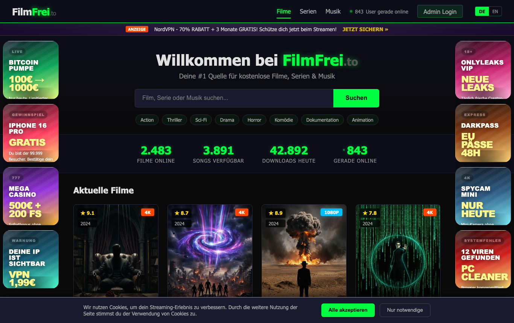
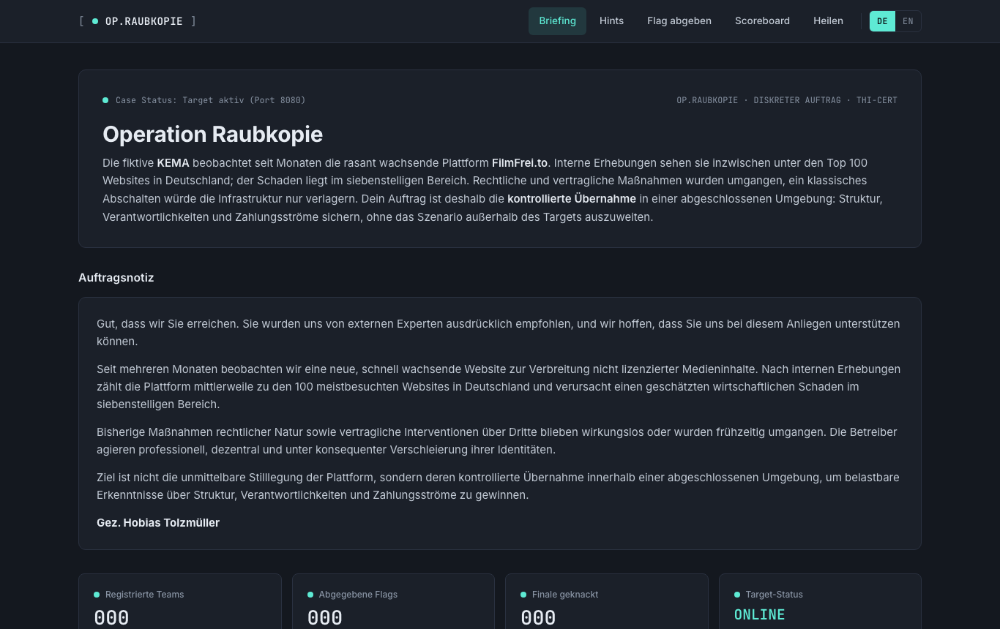

# Operation Raubkopie - CTF Challenge

Willkommen, Operator. Eine Plattform muss vom Netz, und du bist dafür verantwortlich.

## Briefing

Die fiktive **KEMA**, eine Medienrechte-Organisation, beobachtet seit Monaten die rasant wachsende Plattform **FilmFrei.to**. Sie verbreitet nicht lizenzierte Filme, Serien und Musik, hat in kurzer Zeit enorme Reichweite erreicht und verursacht spürbaren Schaden. Rechtliche Schritte und klassische Sperrversuche laufen ins Leere, weil die Betreiber ihre Infrastruktur professionell und blitzschnell verlagern.

Dein Auftrag ist deshalb kein lautes Abschalten, sondern die **kontrollierte Übernahme** der Plattform in einer abgeschotteten Laborumgebung. Du verschaffst dir Zugang, arbeitest dich durch Admin-Bereich, Fallakten und Zahlungsdaten und legst offen, wie Plattform, Betreiber und Geldfluss zusammenhängen. In den Akten taucht immer wieder ein Name auf: **Janus Marsaleck**. Aber verlass dich nicht zu früh auf das Offensichtliche.

## Die zwei Oberflächen

**FilmFrei.to** (`http://localhost:8080`) ist die öffentliche Plattform, dein Spielfeld:



Das **Helper-Portal** (`http://localhost:8081`) ist dein Operator-Cockpit mit Briefing, Team-Registrierung, Hints, Flag-Abgabe und Scoreboard:



## Dein Auftrag: 5 Stages

Die Challenge besteht aus fünf aufeinander aufbauenden Stages. Jede Stage hat ein klares Ziel und gibt dir beim Abschluss eine Flag.

| Stage | Ziel |
| ----- | ---- |
| 1 | Verschaff dir Zugang zum internen Operator-Bereich. |
| 2 | Sichere das vertrauliche Dossier zu den Betreibern. |
| 3 | Beschaffe die Bankdaten hinter der Plattform. |
| 4 | Folge der Geldspur bis zur Krypto-Wallet. |
| 5 | Löse die kontrollierte Übernahme der Plattform aus. |

Nach 5/5 schaltet sich optional die **GOAT-Challenge** frei: ein Bonus-Fall rund um Beweisintegrität und die Frage, wer am Ende wirklich kassiert hat. Sie vergibt ein Prestige-Badge, zählt aber nicht zu den 500 Core-Punkten.

## Punkte und Ablauf

- Maximal **500 Punkte**: 5 Flags mal 100.
- **Flags sind pro Team einzigartig** und werden serverseitig erzeugt. Abschreiben bringt nichts, es zählt dein eigener Lösungsweg.
- **Hint-System**: Steckst du fest, gibt es pro Stage gestufte Hinweise. Jeder aufgedeckte Hinweis kostet Punkte, also überleg kurz, bevor du klickst.
- **Scoreboard**: Team und Fortschritt erscheinen live.

So spielst du:

1. Stack starten (siehe Schnellstart).
2. Im **Helper-Portal** unter `http://localhost:8081` ein **Team registrieren**.
3. Die eigentliche Challenge spielt auf **FilmFrei.to** unter `http://localhost:8080`.
4. Flags, Hints und Scoreboard liegen im Helper-Portal.

## Schnellstart

Voraussetzung: **Docker Desktop**, **Docker Engine** oder **Podman/Podman Desktop** ist installiert. Das Startskript versucht Docker Desktop beziehungsweise die Podman Machine bei Bedarf automatisch zu starten.

- macOS / Linux: `./start.sh`
- Windows (PowerShell): `.\start.cmd`

Unter Windows ruft `start.cmd` das PowerShell-Skript mit passender Execution Policy auf. Alternativ geht auch `powershell -ExecutionPolicy Bypass -File .\start.ps1`.

Das Skript legt `.env` an, setzt ein zufälliges `CTF_SECRET`, startet Docker/Podman best-effort, zieht das Image und wartet, bis die Dienste bereit sind. Danach im Browser öffnen:

- Challenge: `http://localhost:8080`
- Helper-Portal (Team, Hints, Abgabe, Scoreboard): `http://localhost:8081`

Eine ausführliche Schritt-für-Schritt-Anleitung mit Troubleshooting steht in **[QUICKSTART.md](QUICKSTART.md)**.

## Einsatzrahmen

- Alles läuft **nur lokal** (`127.0.0.1`), nicht im Netzwerk und nicht gegen fremde Systeme.
- Bleib im abgegrenzten Target. Es geht um sauberes, nachvollziehbares Vorgehen.
- Kleiner Tipp: Wer das Frontend genau liest, findet mehr als nur die fünf Flags.

## Voraussetzungen im Detail

- macOS, Windows oder Linux
- Docker Desktop, Docker Engine oder Podman/Podman Desktop
- Compose verfügbar (`docker compose version`, `podman compose version` oder `podman-compose --version`)

Hinweise für Linux:

- Docker Engine muss laufen, z. B. über `sudo systemctl start docker`.
- Der ausführende User braucht Docker-Rechte, typischerweise über die Gruppe `docker`.
- Das Skript startet unter Linux bewusst keine Systemdienste per `sudo`; Distributionen unterscheiden sich hier zu stark. Wenn Docker nicht bereit ist, wird Podman versucht oder ein klarer Fehler ausgegeben.

Hinweise für Podman unter Windows:

- PowerShell verwenden, nicht direkt eine Ubuntu-WSL-Shell.
- Falls nötig zuerst `podman machine start`.
- Fehlt der Compose-Provider, versucht `start.ps1` automatisch `podman-compose` nachzuinstallieren.
- Ist WSL2 noch nicht eingerichtet, einmalig in einer Administrator-PowerShell `wsl --install --no-distribution` ausführen und Windows neu starten.

## Manuell starten (ohne Skript)

```bash
cp .env.example .env
# CTF_SECRET auf einen zufälligen Wert setzen, z. B.:
openssl rand -hex 16
docker compose pull
docker compose up -d
```

Im veröffentlichten Student-Release ist `WEB_IMAGE` in `.env.example` bereits auf ein konkretes Release-Image gepinnt. Falls `WEB_IMAGE` leer ist, nutzt du vermutlich das Template aus dem Main-Repo statt des exportierten Student-Repos oder eine alte `.env`.

Mit Podman:

```bash
podman machine start
podman compose pull
podman compose up -d
```

Das GHCR-Image ist öffentlich. Ein `docker login ghcr.io` oder `podman login ghcr.io` ist nicht nötig.

Ist ein Port belegt, in `.env` z. B. `WEB_PORT=18080` und `HELPER_PORT=18081` setzen. Ändere nur die Portnummern, nicht die `127.0.0.1`-Bindung.

## Zugriff

- Challenge: `http://localhost:<WEB_PORT>`
- Helper-Portal: `http://localhost:<HELPER_PORT>`
- Hints: `http://localhost:<HELPER_PORT>/hints.php`
- Flag-Abgabe: `http://localhost:<HELPER_PORT>/submit.php`
- Scoreboard: `http://localhost:<HELPER_PORT>/scoreboard.php`

## Stoppen und Zurücksetzen

```bash
docker compose down        # stoppen
docker compose down -v     # voller Reset: löscht DB, Teams und Scoreboard
```

Mit Podman analog `podman compose down` bzw. `podman compose down -v`. Nutze für den Reset dasselbe Backend, das beim Start unter `Verwendet:` ausgegeben wurde.
Unter Windows kannst du zum normalen Stoppen auch `.\stop.cmd` verwenden.

## Teamnamen

Teamnamen müssen 2 bis 40 Zeichen lang sein und dürfen nur Buchstaben, Zahlen, Bindestrich und Unterstrich enthalten (`A-Za-z0-9_-`). Diese Regel ist Absicht, damit spätere Eingaben in der Challenge per Copy und Paste sauber funktionieren.

Die lokale Student-Version nutzt **einen Spielstand pro Instanz**. Wenn du zuerst in Firefox ein Team registrierst und danach Chrome öffnest, wird Chrome automatisch demselben Team zugeordnet. Hints, Flags, Zeiten, GOAT und Scoreboard sind dadurch browserübergreifend gleich. Für einen komplett neuen Versuch nutze einen Reset mit `docker compose down -v` beziehungsweise dem beim Start angezeigten Podman-Befehl.

## Lokaler Test ohne GHCR

Wenn du das Web-Image lokal gebaut hast, kannst du `WEB_IMAGE` überschreiben:

```bash
WEB_IMAGE=operation-raubkopie-web:latest WEB_PORT=18080 HELPER_PORT=18081 docker compose up -d
```

## Struktur

- `docker-compose.yml`: startet Web, Helper und MySQL
- `.env.example`: Konfiguration für `CTF_SECRET`, `CTF_TEAM_MODE`, `WEB_IMAGE`, `WEB_PORT`, `HELPER_PORT`
- `start.*` / `stop.*`: Wrapper für Docker, Podman und `podman-compose`
- `init.sql`: Datenbank-Seed
- `QUICKSTART.md`: Schnellstart

## Hinweis

KEMA, FilmFrei.to, Janus Marsaleck und alle weiteren Namen sind frei erfunden und ausschließlich Teil dieser Lehr-Challenge. Sie stehen in keinem Bezug zu realen Personen oder Organisationen.
